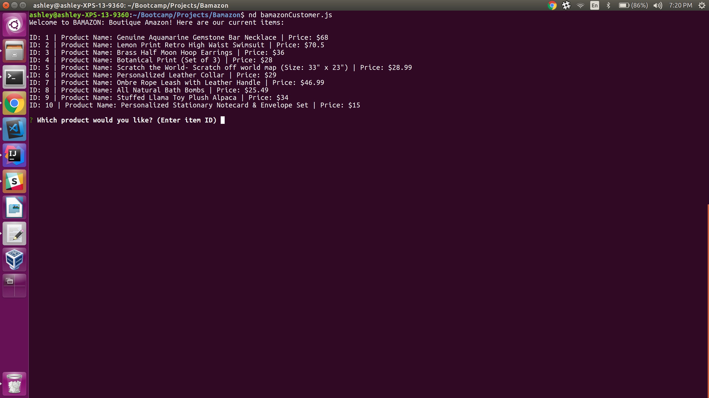
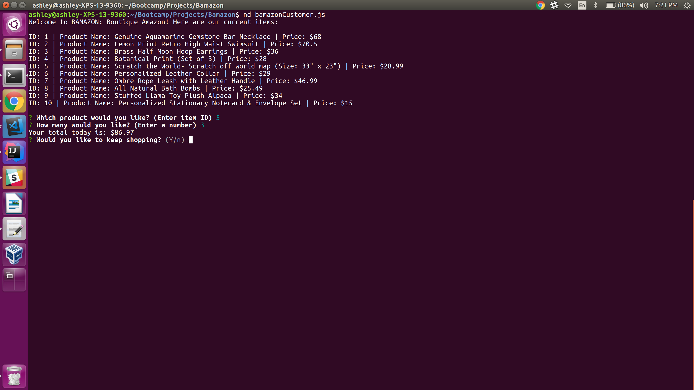
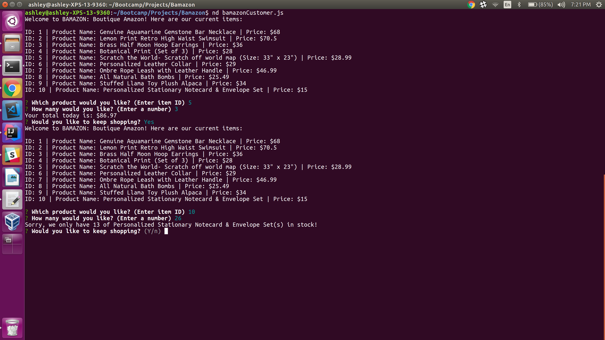
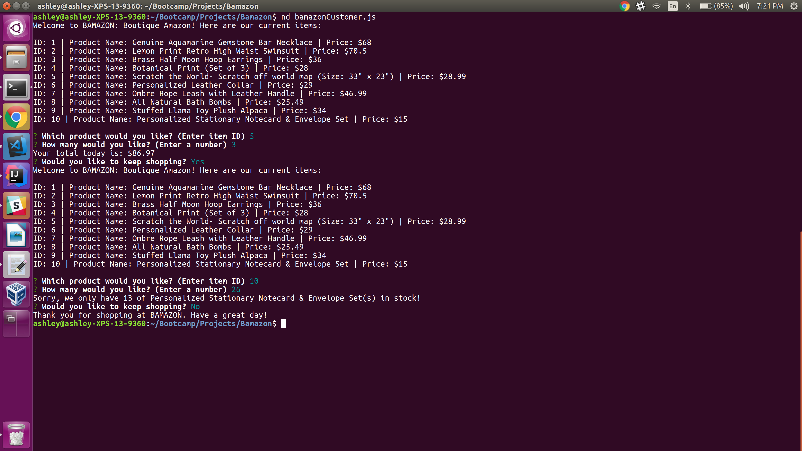

# Bamazon

1. To run the Bamazon app, type 'node bamazonCustomer.js' in command/bash.
2. A list of items will appear and the user will be prompted to buy an item by entering an item id. 
3. Once an item has been selected, the user will be prompted to enter the quantity they would like. 
4. Bamazon will update the database and let the user know the item total then prompt the user to keep shopping or to end shopping. 
5. If the user continues shopping, the product list will appear again. If the user ends shopping, the connection is ended and there is a 'thank you for shopping at Bamazon' message. 

*** Note: I created an alias for node so nd = node --no-deprecation, for personal use. In order to run this app on in your command line, you will still use command: 'node bamazonCustomer.js'

